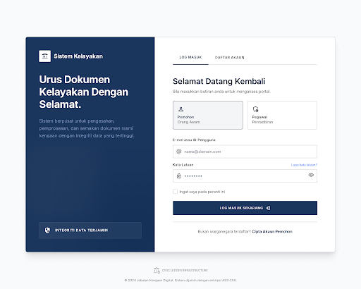
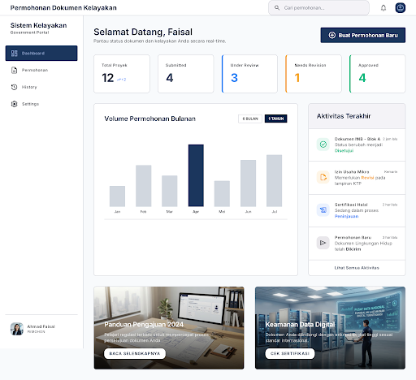
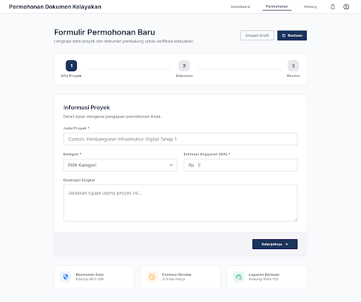
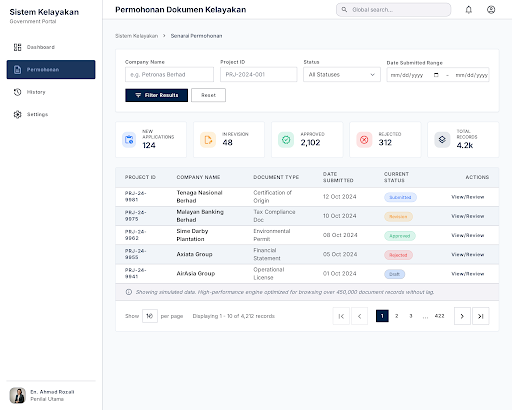
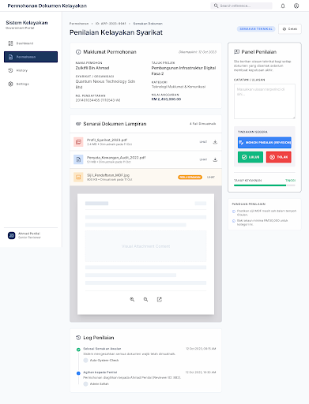

# 🏛️ Sistem Informasi Persetujuan Dokumen Kelayakan
> **Technical Test Assessment — Document Approval System**  
> *Arsitektur Fullstack: Laravel 11 REST API + Vue 3 SPA + PostgreSQL 16 + Redis + Custom Watermark Security Layer*

---

## 📸 Tampilan Antarmuka (Stitch Design Revamp)

Berikut adalah antarmuka aplikasi yang telah dirancang presisi mengikuti **Design System dari Project Stitch (ID: `15261311708996724616`)**:

### 1. 🔐 Portal Login & Autentikasi (`LoginView.vue`)

*Tampilan split-screen modern portal pemerintah dengan indikator keamanan Qi Signature dan tombol Quick Demo Login.*

---

### 2. 📊 Dashboard Pemohon & Grafik Analytics (`PemohonDashboard.vue`)

*Dashboard Pemohon dilengkapi Bento Grid statistik, tabel filter permohonan, dan visualisasi ApexCharts (Tren Bulanan & Rasio Status).*

---

### 3. 📝 Form Pengajuan Dokumen Kelayakan (`PermohonanForm.vue`)

*Formulir pengajuan project dengan area drag-and-drop unggah berkas PDF/DOCX (Maksimal 50MB).*

---

### 4. 👨‍⚖️ Antrean Penilaian Tim Penilai (`PenilaiDashboard.vue`)

*Antrean review permohonan masuk khusus role Penilai/Reviewer.*

---

### 5. ⚖️ Modal Evaluasi & Keputusan Penilai (`ReviewModal.vue`)

*Modal penetapan keputusan (Setujui / Revisi / Tolak) lengkap dengan pengisian catatan evaluasi wajib.*

---

## 🛠️ Spesifikasi Teknologi & Compliance Matriks

| Komponen | Teknologi / Library | Catatan Implementasi |
| :--- | :--- | :--- |
| **Backend Framework** | Laravel 11 (PHP 8.2 FPM) | Standard RESTful API V1 (`/api/v1/`) |
| **Frontend Framework**| Vue 3 SPA (Vite + Pinia + Vue Router) | Tailored Tailwind CSS + Material Symbols |
| **Database Utama** | PostgreSQL 16 | Relasional DB dengan Composite Indexing |
| **Caching & Session** | Redis 7 | High performance caching layer |
| **Security & License** | Custom Watermark (`QiHelp`, `QiLog`) | Protected header `X-Qi-Signature` |
| **Data Analytics** | ApexCharts / Vue3-ApexCharts | Area Chart & Doughnut Chart |
| **Containerization** | Docker & Docker Compose | Nginx + PHP-FPM + Postgres + Redis |

---

## 🔐 Lapisan Keamanan & Protection Watermark (`Qi`)

Aplikasi dilengkapi dengan lapisan **Security & License Signature Layer** (`Qi-Platform-v1`) untuk melindungi kepemilikan kode:

1. **`config/qi.php`**: Menyimpan konfigurasi kunci lisensi (`QI_LICENSE_KEY`) dan system hash (`QI_SYSTEM_HASH`).
2. **`EnsureQiSignature` Middleware**: Memvalidasi setiap HTTP request dan menginjeksikan header kustom:
   ```http
   X-Qi-Signature: QI-VERIFIED-SYSTEM-2026
   ```
3. **`QiLog` Service**: Audit trail terpusat yang mencatat setiap aksi permohonan (`CREATED`, `SUBMITTED`, `DOCUMENT_UPLOADED`, `APPROVED`, `REVISION_REQUESTED`, `REJECTED`) pada tabel `permohonan_logs`.
4. **`QiHelp` Support**: Format API Response terstandarisasi dengan metadata status, timestamp, dan signature.

---

## 🔑 Kredensial Pengujian (Seeder Database)

Database telah di-seed dengan **2.000 Akun User** dan **10.000 Data Permohonan**. Anda dapat login secara manual menggunakan kredensial berikut:

| Role | Email Contoh | Kata Sandi | Rentang Akun Tersedia |
| :--- | :--- | :--- | :--- |
| **Pemohon** | `pemohon1@example.com` | `password` | `pemohon1@example.com` s/d `pemohon1000@example.com` |
| **Penilai** | `penilai1@example.com` | `password` | `penilai1@example.com` s/d `penilai1000@example.com` |

*Catatan: Anda juga dapat menggunakan tombol **Quick Demo Login** (`Demo Pemohon` & `Demo Penilai`) pada halaman login.*

---

## ⚡ Panduan Instalasi & Jalankan Lokal (Docker)

### 1. Clone & Masuk ke Folder Project
```bash
git clone <repository-url>
cd ApprovalDocuments
```

### 2. Salin Berkas Environment
```bash
cp backend/.env.example backend/.env
```

### 3. Jalankan Docker Container
```bash
docker-compose up -d --build
```

### 4. Eksekusi Database Migration & Optimized Seeder (10.000 Data)
```bash
docker exec -it approvaldocuments-app-1 php artisan migrate:fresh --seed --class=DatabaseSeedingOptimizer --force
```

### 5. Jalankan Frontend Vue 3 SPA
```bash
cd frontend
npm install
npm run dev
```

Akses aplikasi di browser:
- **Frontend SPA**: `http://localhost:5173`
- **Backend API**: `http://localhost:8000/api/v1/`

---

## 📑 Daftar Endpoint REST API V1

### Autentikasi
- `POST /api/v1/login` — Login user & penerbitan Sanctum Bearer Token
- `POST /api/v1/register` — Registrasi akun pemohon baru
- `GET /api/v1/me` — Profil user aktif & role
- `POST /api/v1/logout` — Revoke token & logout

### Permohonan Dokumen
- `GET /api/v1/permohonan` — Daftar permohonan (paginated & searchable)
- `POST /api/v1/permohonan` — Buat draft permohonan baru
- `GET /api/v1/permohonan/{id}` — Detail permohonan, berkas, & audit logs
- `PUT /api/v1/permohonan/{id}` — Perbarui draft / permohonan revisi
- `POST /api/v1/permohonan/{id}/submit` — Kirim permohonan ke tim penilai
- `POST /api/v1/permohonan/{id}/upload` — Unggah berkas dokumen lampiran
- `DELETE /api/v1/permohonan/{id}/documents/{docId}` — Hapus berkas lampiran

### Penilaian (Role Penilai)
- `GET /api/v1/penilaian/queue` — Antrean permohonan berstatus `submitted`
- `POST /api/v1/penilaian/{id}/review` — Simpan keputusan (`approve`, `revision`, `reject`) + catatan evaluasi

---

## 👨‍💻 Lisensi & Hak Cipta
Diisi oleh kandidat pengembang sebagai bagian dari verifikasi dokumen uji teknis kelayakan (Technical Test Programmer 2026).
